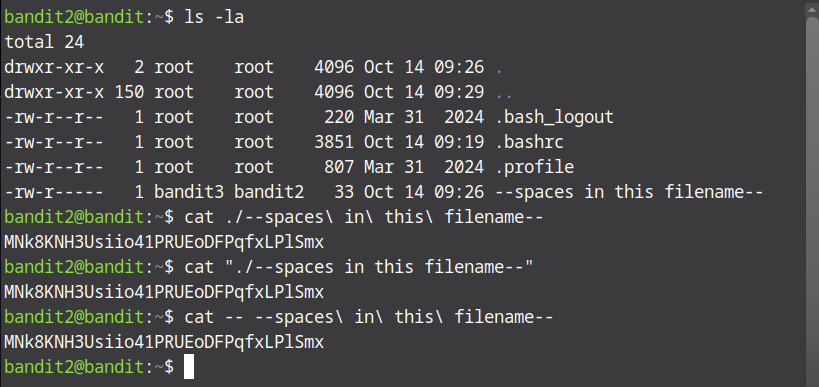

# Bandit Level 2 → Level 3

SSH into bandit 2 using the password you found from the previous level. After that, list all files in the home directory using `ls -la`. You should see a file named `--spaces in this filename--`. Because the filename contains spaces and begins with dashes typing `cat --spaces in this filename--` won't work, instead you can use safe forms such as `./` to avoid option parsing `cat ./--spaces\ in\ this\ filename--`, quote the filename `cat "--spaces in this filename--"` or you can use `--` to mark the end of options `cat -- ---spaces\ in\ this\ filename---`. You can also combine `./` with quotes `cat "./--spaces in this filename--`. Any of the commands above will display the password for the next level.

