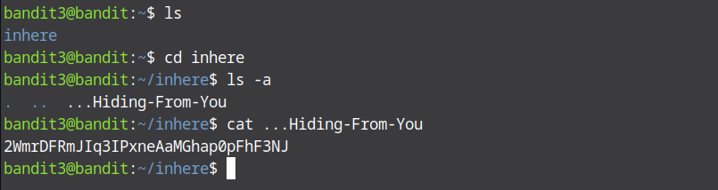

# Bandit Level 2 → Level 3

First as usual ssh into the next bandit which is bandit 3. Then list the files in the home directory, you'll see a directory named `inhere`. Move into that directory using `cd inhere`. List all files in this directory including hidden ones using `ls -a`, a hidden file named `..Hidden-From-You` will appear and finally display the content of the hidden file using `cat ..Hidden-From-You` and the password for the next level will be shown.

