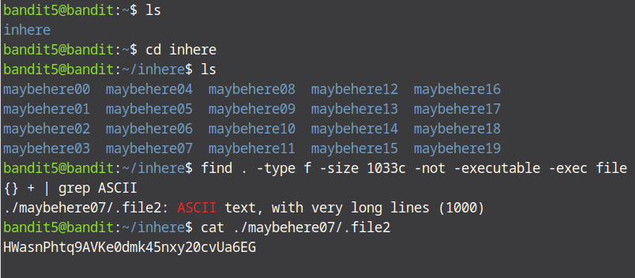

# Bandit Level 4 → Level 5

In this level we are expected to look for a file using its specific features such as its size, it type and if it being non-executable. Afer logging into the level go to inhere directory and list the files in there. You'll see many directories in there, but we do not know in which directory the file we are looking for is. So we need to find the file from the current directory(inhere). To do that we can use the `find` command. To specify the size the command is `-size 1033c`, 1033c is the size of the file we want, find uses `c` to represent bytes. To look for non-executable files the command is `-not -executable`. And to specify the type we use the `grep` command which is used to find patterns, so to find readable file we use `grep ASCII`. Generally to find the password for this level the command is :

```find . -type f -size 1033c -not -executable -exec file {} + | grep ASCII```
The `.`: enables us to look for files in the current directory only.
`-type f` helps to find only files.
`-exec file {} +` is used to execute the `file` command on all the results returned by the find command.
`|`: is called pipe and it is used to give the reults before it as input to a command after it in this case the grep command.


