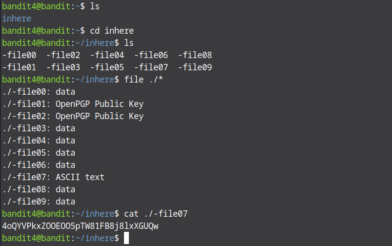

# Bandit Level 4 → Level 5

For this level we are supposed to find the only human-readable file. So to get started ssh into the level and list all files in the current directory, you will see a directory name inhere. Move to that directory and list all files inside that directory, you'll see many files without extensions. To find the one that contains readble text use the `file` command. Since there are multiple files use `file ./*` which lets us find the type of the all the files in the current directory. You will get the type of each file. The one with the `ASCII` type is the one that contains readable text. Once you find this file display its content and the passsword for the next level is right there.

