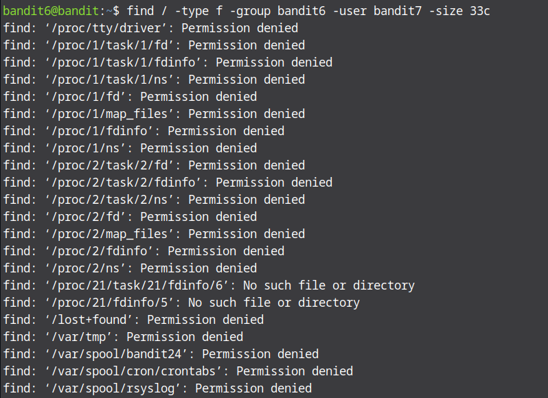
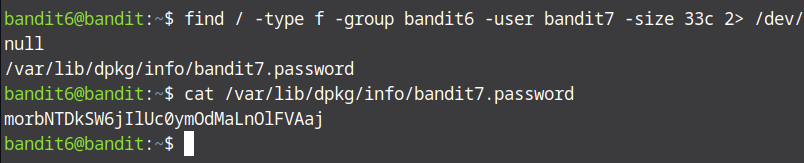

# Bandit Level 6 → Level 7

In this level, we asked to find a file somewhere in the home directory that is owned by user `bandit7`, group `bandit6` and has a size of 33 bytes. To find this file we use the find command again as follows 
```bash
find /home -type f -user bandit7 -group bandit6 -size 33c
```
* / : is to find all files in the home directory
* -type f : to find files only
* -group bandit6 : to find the specific group
* -user bandit7 : to find the specific owner
* -size 33c : to specify the file's size



*This command will display many files saying 'permission denied'. We can avoid this sending the error stream denoted by number 2 to /dev/null . NULL is a special device on Linux which destroys all that data that is sent to it. So the command becomes ```bash find / -type f -user bandit7 -group bandit6 -size 33c 2> /dev/null```
.Now that we have found the file, let us go ahead and dosplay its contents. !Wala we found the password for the next level.


