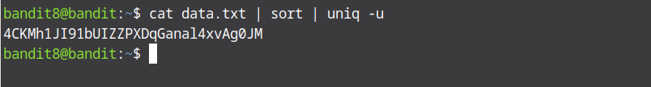

# Bandit Level 8 → Level 9

In this level to find the password we need to filter out a line that occurs only once in the data.txt file. To achieve this we will use two very important commands together which are `sort` and `uniq`. First we will sort the lines and give the sorted lines as inputs for uniq to filter out the only line that is not repeated along with `-u` flag. You might be asking why the sort command is needed, that is a very a valid question. We must use the sort command because the uniq command expects the repeated lines to appear next to each other so we need to sort our data before finding the unique one.

The command is :
```bash
   cat data.txt | sort | uniq -u
````


