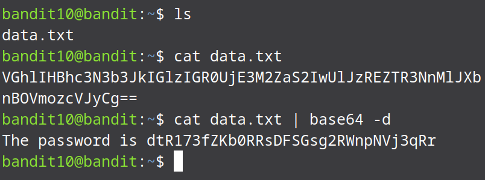

# Bandit Level 10 → Level 11

From the question we know that the file is base64 encoded so we can use the `base64` command with `-d` flag to decode it.
The command for this level looks like: 
* ```bash
  cat data.txt | base64 -d```

  
