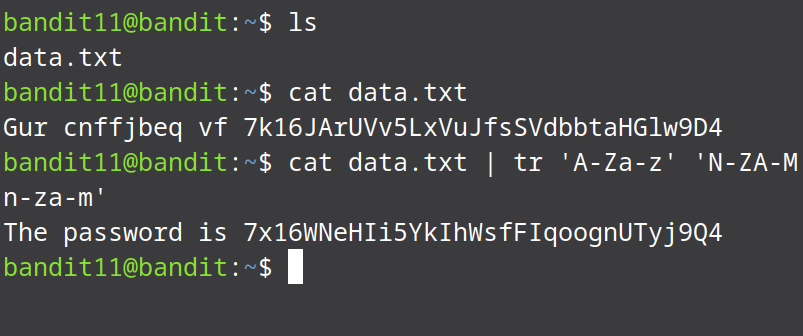

# Bandit Level 11 → Level 12

After listing the file in the current working directory and viewing the data of the file, we know that the characters are rotated by 13 characters; this means the file contains ROT13 encoded text. To rotate them to their original order we can use the tr command which is used to translate/transform data from one form to another.

* ```bashcat data.txt | tr 'A-Za-z' 'N-ZA-Mn-za-m'```

  
