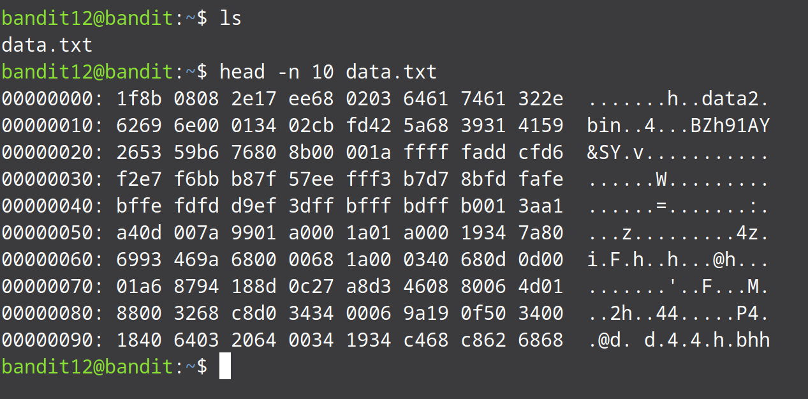
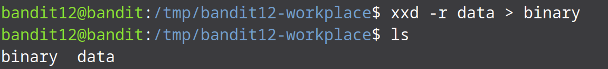
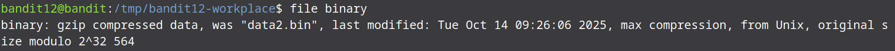
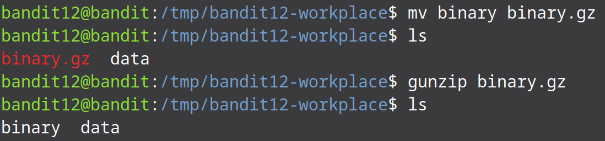
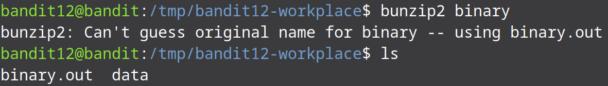
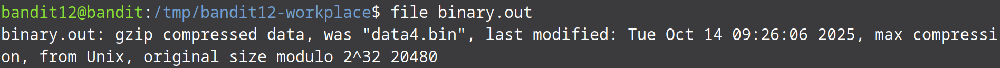
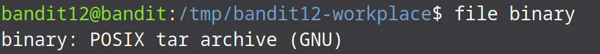
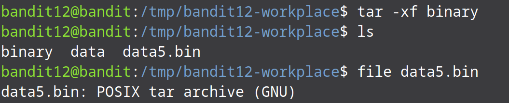
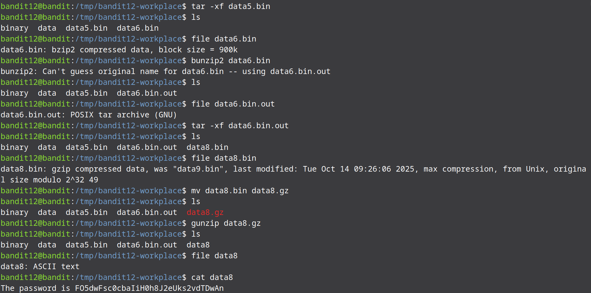

# Bandit Level 12 → Level 13

The password for the next level is stored in the file `data.txt`. That file is a hexdump (hex representation) of a file that has been repeatedly compressed. Our task is to get the original binary from the hexdump, then repeatedly decompress until we reveal the password.

Let us start by listing the files in the current working directory. If we see the first 10 lines data of the file we can see that the file consist of hexadecimal data. We have to convert this hexdecimal data to binary to get back the actual file. We can use the `xxd` command that allows us to manipulate hexadecimal data. The `-r` flag is used to tell xxd to reverse the operation (hex to binary)

But before we do any of this we first need to create a temporary working directory in the /tmp directory as we do not have permission to create new files in the current location. We can do this using the `mkdir` command. We now need to move data.txt to this new location. We can do this using the `cp` command. To move into the new directory we can use the `cd` command. And then we rename the file to remove the .txt extension as we know the file is not an text file using `mv`.

Now that the data is in the new directory we can now use `xxd` to convert the data into its binary form.

Now that we have converted the data back into its binary form we can use the `file` command to see what type of data is stored in the file.

We can see that the file was compressed using `gzip` so we can decompress the data using the `gunzip` command(Gunzip is shorthand for `gzip -d` command). When trying to decompress a gzip file it is important that the file has the correct extension(`.gz`).

Using the `file` command we can again look at the type of the data that is stored in the file.

We see that the data is compressed using `bzip2`. For decompressing a bzip2 file we can use the `bunzip2` command(shorthand for `bzip2 -d`).

Using the `file` command we can look at the type of the data that is stored in the file.

We see that its once more `gzip` compressed file. We use the same procedure as we did before to decompress the file. Don't forget to rename the file with the `.gz` extension for the file to be decompressed properly.

Using the `file` command we look at the type of data in the file.

We see that the data is saved in a `tar` archive. For extracting a tar file we use the `tar` command. The `-r` flag is used to specify that we want to extract the data and `-f` flag is used to specify the filename.

It looks like the password file has recursively been compressed using `tar`, `gzip` and `bzip2`. We keep repeating the above steps till we get the password file.

