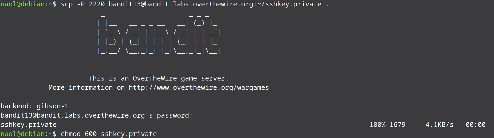
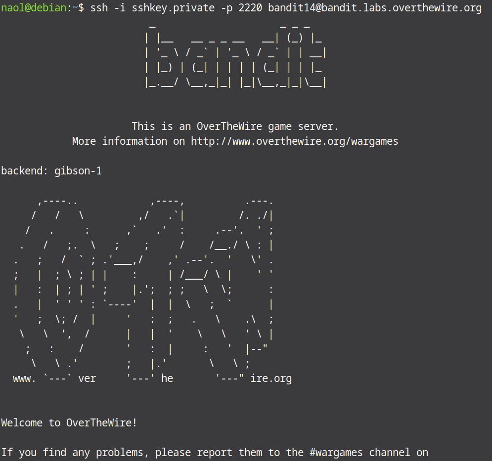
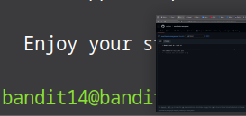
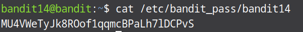

# Bandit Level 13 → Level 14

In this level we use private SSH key we find in this bandit to login as bandit14.

To start this level ssh into level 13 and list the files in the home directory. You will see a file named `sshkey.private`. This is a private SSH key you will use to authenticate as bandit 14. After getting our SSH key we can’t ssh from inside the bandit server because overthewire blocks ssh connections to port 2220 from inside the bandit server itself to save system resources.We’ll need to download or copy the private key to our local machine and use it there.


So let us logout of the bandit 13 shell and copy the private key to our local machine. To achive this run then following command:

```bash
scp -p 2220 bandit13@bandit.labs.overthewire.org:~/sshkey.private .
```
* scp = secure copy
* -P 2220 = use the Bandit port
* The last dot `.` means “save it here” in your current directory

When asked for a password, enter the level 13 password.

After copying the key to our machine, we need to restrict the key's permissions because ssh won’t accept a key that’s too open. To do that we use chmod 600 as follows:

```bash
chmod 600 sshkey.private
```



And finally we can login as bandit14 using the key from our machine.

```bash
ssh -i sshkey.private -p 2220 bandit14@bandit.labs.overthewire.org
```

* The -i flag is used to use ssh with private key.





After logging in as bandit14 we can find the level's password in the directory provided in the question which is etc/bandit_pass/bandit14.

```bash
cat etc/bandit_pass/bandit14
```


