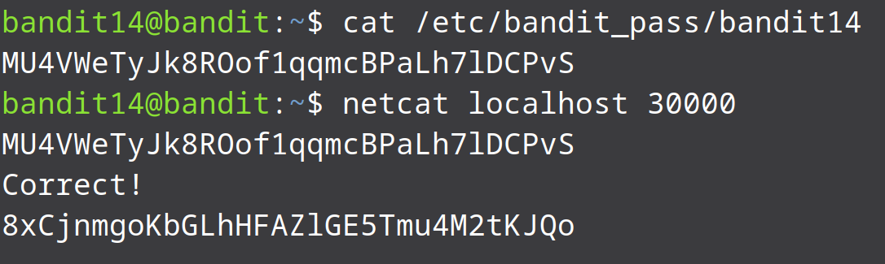

# Bandit Level 14 → Level 15

In this level we are asked to send the current password to port 30000 on localhost. From the question we know that there is a service that is running on port 30,000. We can try to connect to the service using netcat command. Netcat(nc) is a command-line utility used to read and write data across network connections using TCP or UDP protocols. You can use netcat to debug and monitor network connections, scan for open ports, transfer data, as a proxy, and more.

Since we need to send the current password to a port on localhost we need to have our password ready. From previous level we know that the current password is found in the etc/bandit_pass/bandit14 directory.

```bash
cat /etc/bandit_pass/bandit14
```

After netcat command we will be prompted for the current password. We should enter the current password and then press "enter".

```bash
netcat localhost 30000
```


