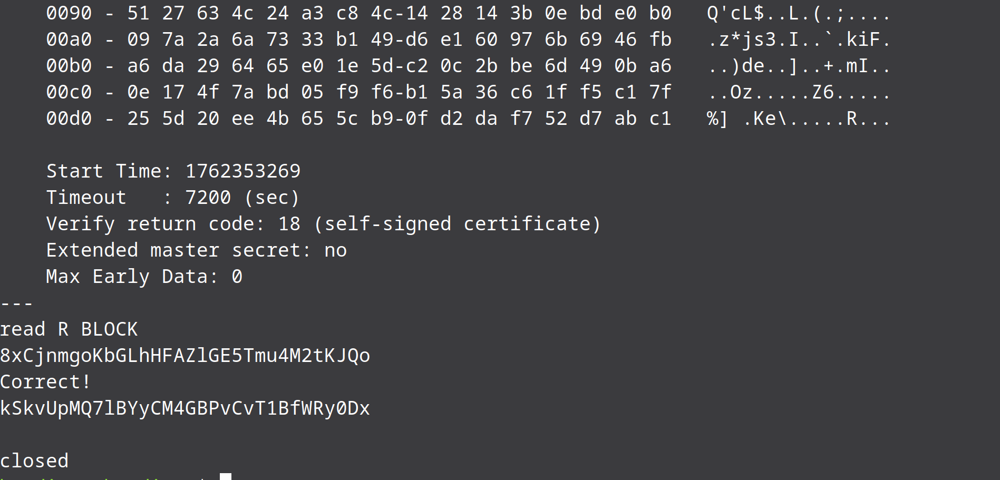

# Bandit Level 15 → Level 16

We know that we have to connect to a service on port 30,001 using SSL encryption. The way to do this is using the openssl command along with s_client which allows to connect to services on our machine using SSL.

Lets provide the correct password and see if we get the password for the next level.

