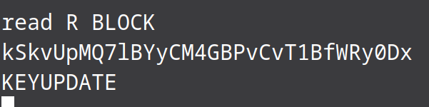
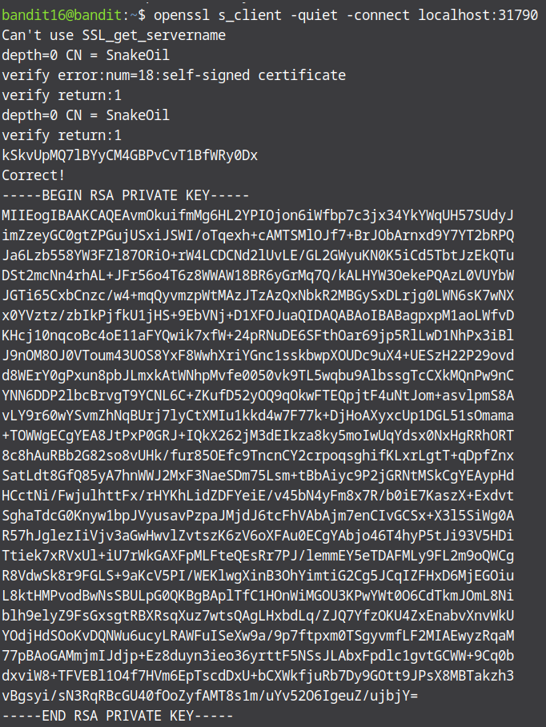
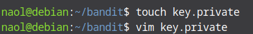
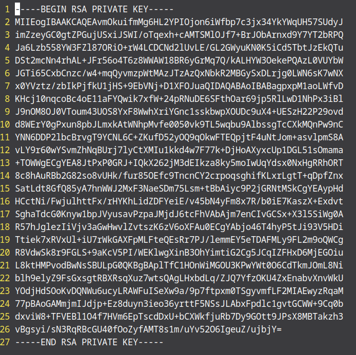
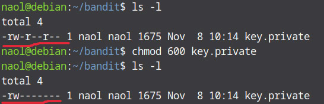
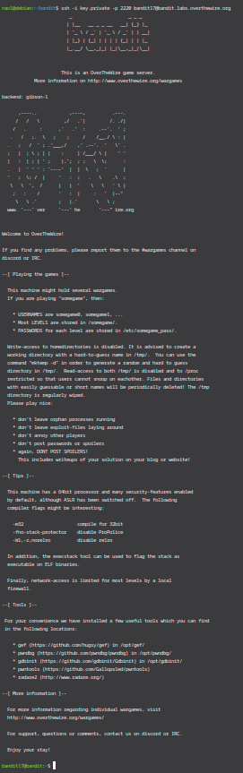

* We know that in the previous levels we needed to send that level's password to localhost on a specific port. In this level what is different is that the specific port is not specified. We are told that the port we are looking for is in the range of 31000-32000 and it should speak ssl. So we need to do some post scanning in order to find the port and then send the password on it. And we have the best tool for the job. The most famous tool for port scanning is nmap. Nmap (Network mapper) is an open-source linux tool for network and security auditing. The tool helps network administrators reveal hosts and services on various systems. We can use some interesting flags like -T4 to increase speed of the scan, -sV to look for open ports on services and -p to specify the port/ports we scan.

nmap -sV -p 31000-32000 localhost

* The command gave us quite a bit of useful information. First, it managed to detect that a number of 5 ports are open. We are also able to see that out of these 5 ports, only 2 speak ssl and only one presents a service other than echo. Our best bet would be that this is the exact port we need to connect to.

Therefore, we will now proceed to openssl using that port:

* The openssl command successfully initiated the connection to localhost using the port we just found moments ago. Now, all we need is to submit the current password to it. But there is a problem, I found that by default, OpenSSL runs in interactive mode. This means entering the characters Q, R, K, and k will be treated as commands. Our password starts with ‘k’, which, according to the manual, will send a key update message to the server. 

* To prevent this, we need to disable interactive mode by adding the -quiet flag.

* And yes that solved it. As we can see we did not get any password but we got an RSA Key that can be used with SSH to access the next level. We need to save the key in a file on our local machine to be used with SSH. So copy the RSA key first, exit out of bandit and create a file in your local machine. I will name the file key.private. After creating the file, open it with any text editor and paste the key we just copied and save it.

* The SSH key cannot be used unless only the file owner has read/write access to it, so we use chmod to change its permissions. You can see in the picture before and asfter the command.

* Finally we can login into level 17 using ssh and the key:

* We can find the password in the etc/bandit_pass/bandit17 folder:

