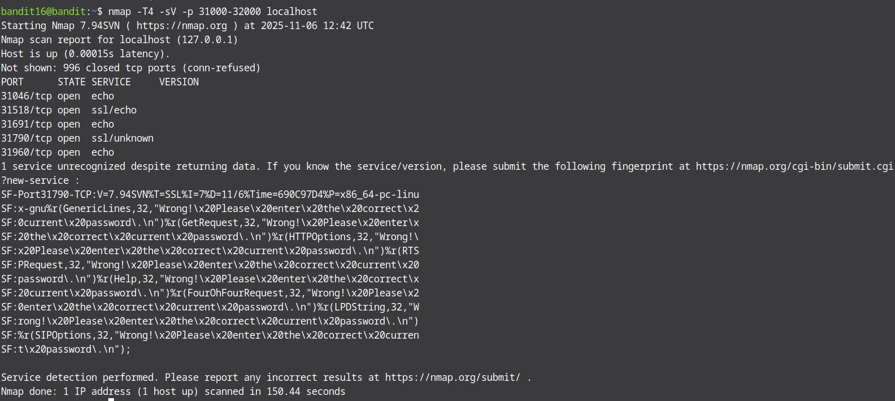

We know that in the previous levels we needed to send that level's password to localhost on a specific port. In this level what is different is that the specific port is not specified. We are told that the port we are looking for is in the range of 31000-32000 and it should speak ssl. So we need to do some post scanning in order to find the port and then send the password on it. And we have the best tool for the job. The most famous tool for port scanning is nmap. Nmap (Network mapper) is an open-source linux tool for network and security auditing. The tool helps network administrators reveal hosts and services on various systems. We can use some interesting flags like -T4 to increase speed of the scan, -sV to look for open ports on services and -p to specify the port/ports we scan.

nmap -sV -p 31000-32000 localhost

The command gave us quite a bit of useful information. First, it managed to detect that a number of 5 ports are open. We are also able to see that out of these 5 ports, only 2 speak ssl and only one presents a service other than echo. Our best bet would be that this is the exact port we need to connect to.

As such, we will now proceed to openssl using that port:

The openssl command successfully initiated the connection to localhost using the port we just found moments ago. Now, all we need is to submit the current password to it:
