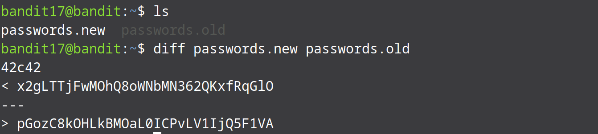

* Begin by listing the files in the home directory:

* We know that both the files differ in only one line and that line consist of the password that we require. We can view the changes that have been made in files using the diff command:

* The < sign represents the lines that have been removed and the > sign represents the lines that have been added in its place. The line after the < sign is the password for the next level.

* Logout of the current session and login into the next level using the password for bandit18. When we try to login we are going to get kicked out saying “Byebye!”. This is normal, this is part of the challenge for the next level.
