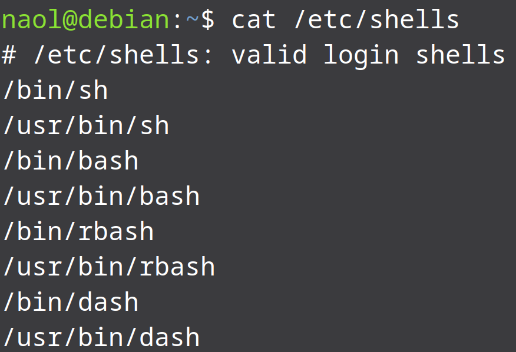
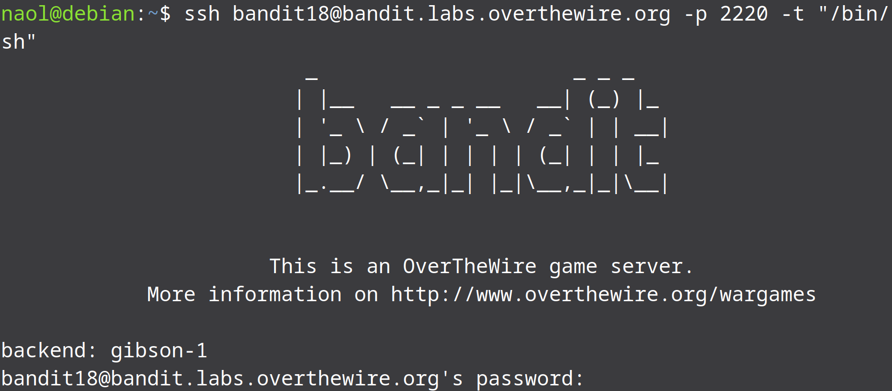
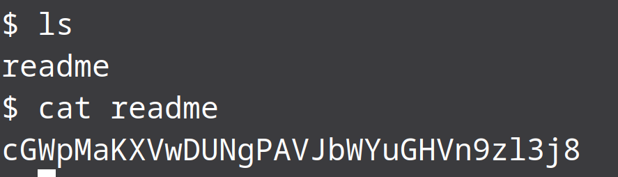

*As we remember from the previous level, we couldn't login to level 18 because the default shell “Bash” has been modified to not allow any login using SSH. So we need to use a shell other than bash to access the system. All the shells that are available in a system are stored under /etc/shells(for linux). So to take a look at them we can use cat /etc/shells.



*As we can see from the picture, we found about 8 shells. Now that we know we have other shells other than the default "Bash" shell that is restricted, we can login into level 18 using a different shell. To do that we will use -t flag to specify the shell we would like to be used to login into then system.

```bash
ssh bandit18@bandit.labs.overthewire.org -p 2220 -t "/bin/sh"
```



*We have logged in successfully this time. Now all we got to do is open the readme file in the home directory to find next level's password.


