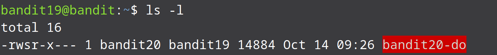
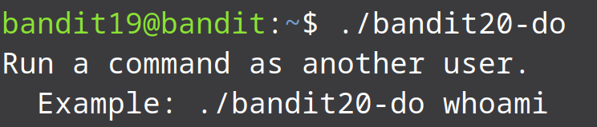
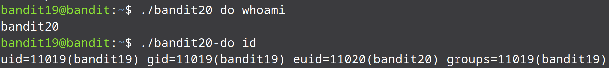
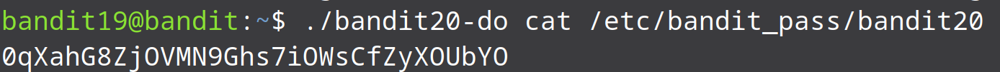

* For this level, we are told that there is a binary file in the home directory which will help us to access the next level's password. To begin this level, let us list the available files in the homedirectory and make sure the binary file is there.

* As we expected we see a file named bandit20-do which is owned by bandit20 and can be executed by the currect user which is bandit19. To run an executable file we just need to write its name along with its direction.

* The file is telling us to run the commnads as another user. So we are allowed to run commands as a user 20. For example it is telling us to run a command whoami as another user so let us run two commands whoami and id and see if it works:

* It sure does work. We can see that when we use the binary file we are assigned the uid for bandit20 as well which means we can run commands as if we are bandit20.

* Now that we know we can run commands as bandit20 so lets use the binary to access the password of user bandit20.

