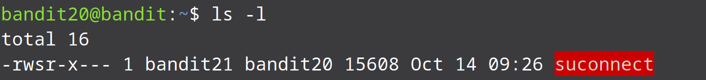
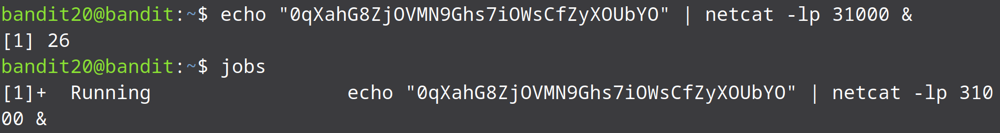
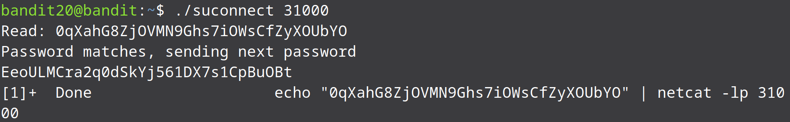

* As the previous level we have a binary file in this level too. Only this time we will use the binary file to send a connection to a port that we specify to read a line of text. It checks if the line is the same as the current password and sends the password for the next level.

* So our task is to setup a listener on any port on a system that will return the previous level's password. We can use netcat to setup a listener:

echo "0qXahG8ZjOVMN9Ghs7iOWsCfZyXOUbYO" | netcat -lp 1000 &

* The -l flag is to setup a listener and the -p flag as we already know is to specify the port the listener should listen on. 1234 is the port. The “&” at the end of the command is used to specify that we want the command to run in the background. The jobs command can be used to view all the processes on the system. Since we haven't specified the IP address the listener is going to run on localhost.

* After setiinng up the listener, we can now use the binary file to connect on the same port and do its match checking:

./suconnect 1000

