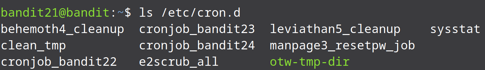
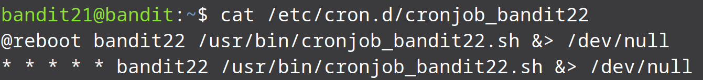
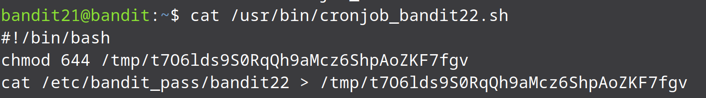
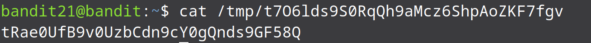

* We know that a program is running automatically at regular intervals. How do we run programs at regular intervals though? This where cron comes in. Cron is a shell command for scheduling a job to run periodically at a fixed time, date, or interval.

* We have been told to look in /etc/cron.d/ for the configuration and see what command is being executed:

 

* There are many cron jobs in the system that are being executed. Since we are looking for the password for bandit22 the task that we focus on should be cronjob_bandit22.

 

* When we look at the cron job for bandit22 we see that there is a shell script that is being executed every second.

* Lets have a look at the contents of the script and try to understand what is it trying to perform:

* When we look at the script we see that it is creating a file called t7O6lds9S0RqQh9aMcz6ShpAoZKF7fgv in the /tmp directory and then saving the password for the next level into that file.

* Lets view the content of the file that is created by the script:

And that is it we have found the password for the next level.
