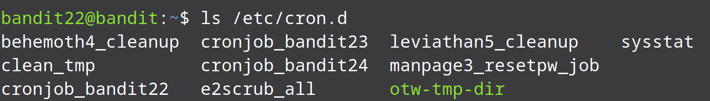
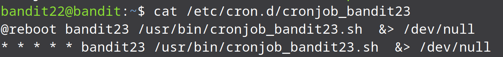
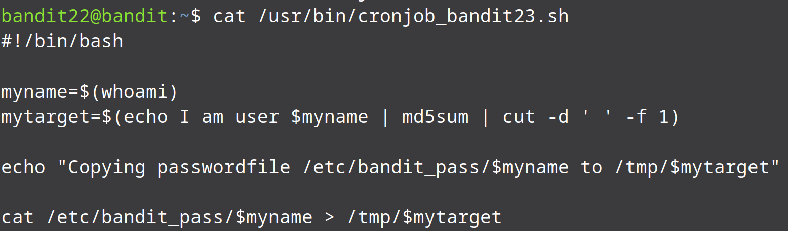
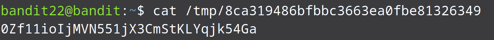

* This level is basically the previous level just a bit modified. We are supposed to look in `/etc/cron.d` for the configuration and see what command is being executed regularly.



* We get the same files we got in the previous level. Since we are now in level 22 we need to look in `cronjob_bandit23`.



* As in the previous level we can see that there is a shell script that is being executed every second. Let us see what the script is doing:



* Woo a lot is happening here:
* First the output of `whoami` command is being saved in a variable named `myname`(since this script is being executed for bandit23 the output of whoami will be bandit23).

* Then the text `I am user bandit23` is given as an input to a `md5sum` command which will calculate md5sum of the text passed to it. Finally using `cut` command, the output of the md5sum command is selected and saved in the variable `mytarget`.

* Then a file is being created in the `/tmp` directory with the name of the file being the same as the value of mytarget.

* And finally the password of bandit23 is being saved into that file.


* So having the above scripts understood, let us find the value of the variable `mytarget` and find the password. To do that write the command shown to find mytarget as it is except for the variable myname, change it to bandit23:

```bash
echo I am user bandit23 | md5sum | cut -d ' ' -f 1
```


* Now that we have the value of the variable mytarget, we can look in the content of `/tmp/mytarget` and check if it contains the password for the next level.


